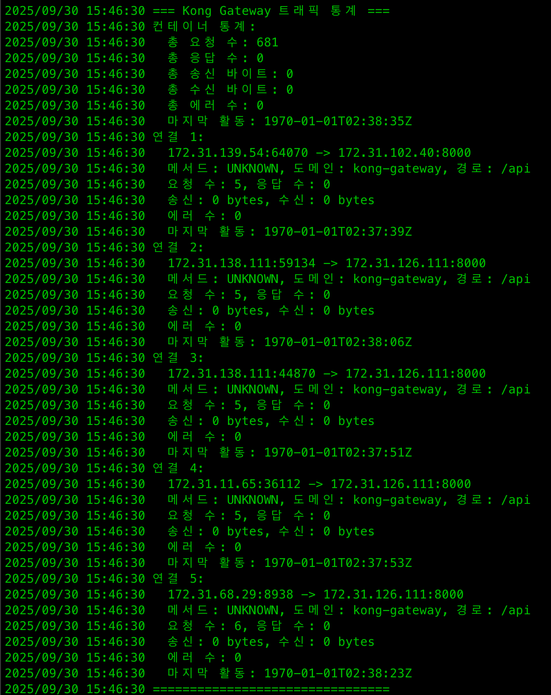

# Kong Gateway eBPF Monitor

Kong Gateway의 트래픽을 eBPF를 사용하여 실시간으로 모니터링하는 Go 애플리케이션이다.

## 기능

- **실시간 트래픽 모니터링**: XDP를 사용하여 네트워크 패킷을 인터셉트
- **HTTP 메서드별 분류**: GET, POST, PUT, DELETE 등 HTTP 메서드별 통계
- **도메인별 분류**: Host 헤더를 파싱하여 도메인별 통계
- **경로별 분류**: HTTP 경로별 통계
- **연결별 상세 추적**: BPF_HASH를 사용한 연결별 상세 통계
- **컨테이너별 집계**: BPF_ARRAY를 사용한 컨테이너별 집계 통계
- **실시간 이벤트**: BPF_RINGBUF_OUTPUT을 사용한 실시간 이벤트 스트림

## 아키텍처

```
┌─────────────────────────────────────────┐
│              Same Pod                   │
│                                         │
│  ┌─────────────────┐  ┌───────────────┐ │
│  │ eBPF Monitor    │  │ Kong Gateway  │ │
│  │ Container       │  │ Container     │ │
│  │                 │  │               │ │
│  │ [eBPF Program] ─┼──┼→ [HTTP API]   │ │
│  │                 │  │               │ │
│  └─────────────────┘  └───────────────┘ │
│                                         │
└─────────────────────────────────────────┘
           ↑
    External Traffic
    (from other pods/services)
```

## 요구사항

- Linux 커널 4.18+ (eBPF XDP 지원)
- Go 1.21+
- clang, llvm (eBPF 컴파일용)
- bpftool (디버깅용, 선택사항)
- Podman (컨테이너화용)

## eBPF 맵 구조

### BPF_HASH - 연결별 상세 추적 (`conn_map`)

- **키**:`conn_key` 구조체
  - 소스 IP (4바이트)
  - 목적지 IP (4바이트)
  - 소스 포트 (2바이트)
  - 목적지 포트 (2바이트)
  - 프로토콜 (1바이트)
  - HTTP 메서드 (1바이트)
  - 패딩 (2바이트, Go 구조체 호환성)
  - 도메인명 (64바이트 고정)
  - 경로 (128바이트 고정)
- **값**:`conn_stats` 구조체
  - 요청 수, 응답 수, 송신 바이트, 수신 바이트, 에러 수, 마지막 활동 시간
- **최대 엔트리**: 10,000개

### BPF_ARRAY - 컨테이너별 집계 (`container_stats_map`)

- **키**: 컨테이너 ID (4바이트 인덱스)
- **값**:`container_stats` 구조체
  - 총 요청 수, 응답 수, 송신 바이트, 수신 바이트, 에러 수, 마지막 활동 시간
- **최대 엔트리**: 1,000개

### BPF_RINGBUF_OUTPUT - 실시간 이벤트 (`traffic_events`)

- **버퍼 크기**: 256KB
- **이벤트 구조**:`traffic_event` 구조체
  - 이벤트 타입 (4바이트): 요청(1), 응답(2), 에러(3)
  - 소스/목적지 IP 및 포트
  - HTTP 메서드, 도메인(64바이트), 경로(128바이트)
  - 타임스탬프, 바이트 수, HTTP 상태 코드

## 기대 결과

```
2024/01/15 10:30:00 Kong Gateway eBPF Monitor 시작
2024/01/15 10:30:00 XDP 프로그램이 인터페이스 eth0 (인덱스 2)에 연결됨
2024/01/15 10:30:00 Ctrl-C를 눌러 종료

=== Kong Gateway 트래픽 통계 ===
컨테이너 통계:
  총 요청 수: 150
  총 응답 수: 148
  총 송신 바이트: 45600
  총 수신 바이트: 23400
  총 에러 수: 2
  마지막 활동: 2024-01-15T10:30:00Z

연결 1:
  192.168.1.100:54321 -> 10.0.0.5:8000
  메서드: GET, 도메인: api.example.com, 경로: /users
  요청 수: 25, 응답 수: 24
  송신: 1200 bytes, 수신: 800 bytes
  에러 수: 1
  마지막 활동: 2024-01-15T10:30:00Z
===============================

[10:30:05] REQUEST 192.168.1.100:54321 -> 10.0.0.5:8000 | GET api.example.com/users | 1200 bytes | 상태: 0
[10:30:05] RESPONSE 10.0.0.5:8000 -> 192.168.1.100:54321 | GET api.example.com/users | 800 bytes | 상태: 200
```

# 결과

## 실제 결과



원하는 데이터가 아님.
왜지? 무엇이 잘못된건가?