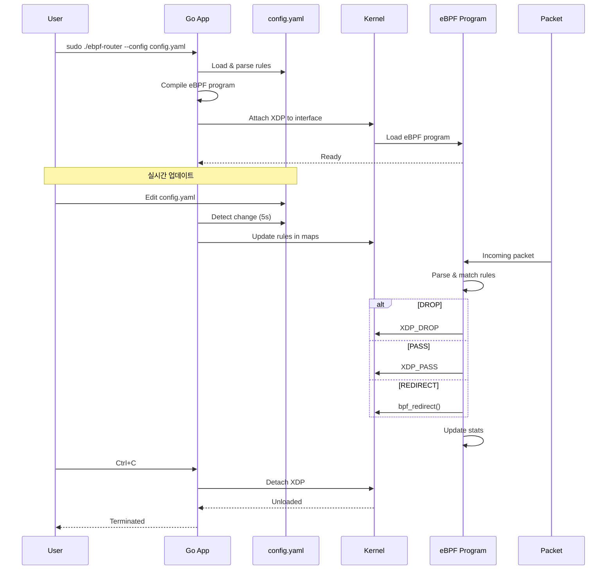

<h2 align="center">eBPF Router</h2>

  
  
  
  

  <em>
    eBPF Router는 커널 레벨에서 동작하는 네트워크 패킷 필터링 및 라우팅 시스템입니다. 
    XDP(eXpress Data Path)를 활용해 패킷을 실시간으로 분석하고, 
    사용자 정의 규칙에 따라 <b>DROP / PASS / REDIRECT</b> 동작을 수행합니다.
  </em>

  

 

