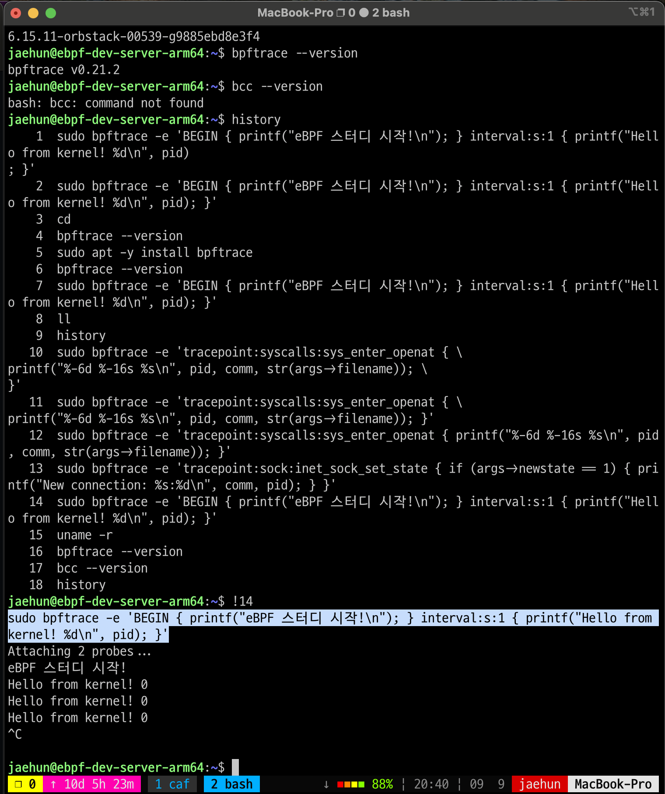
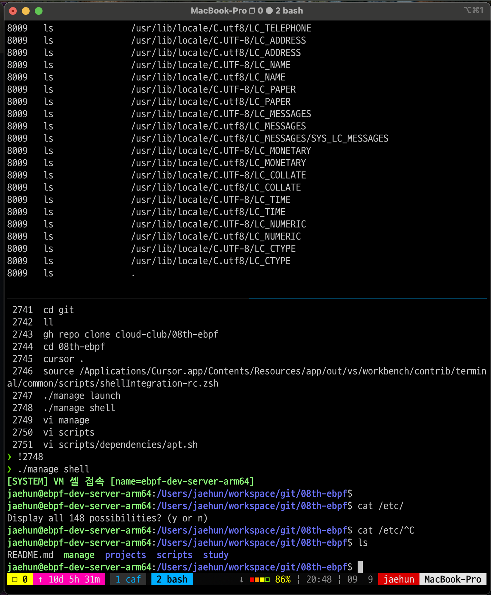
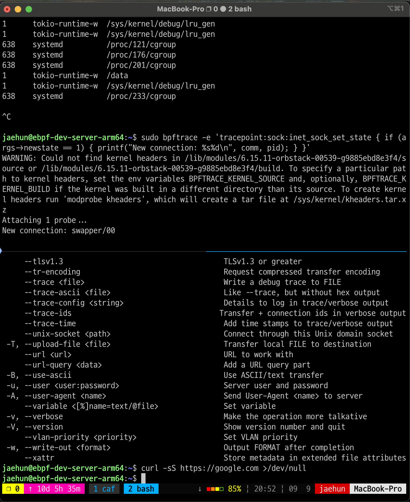
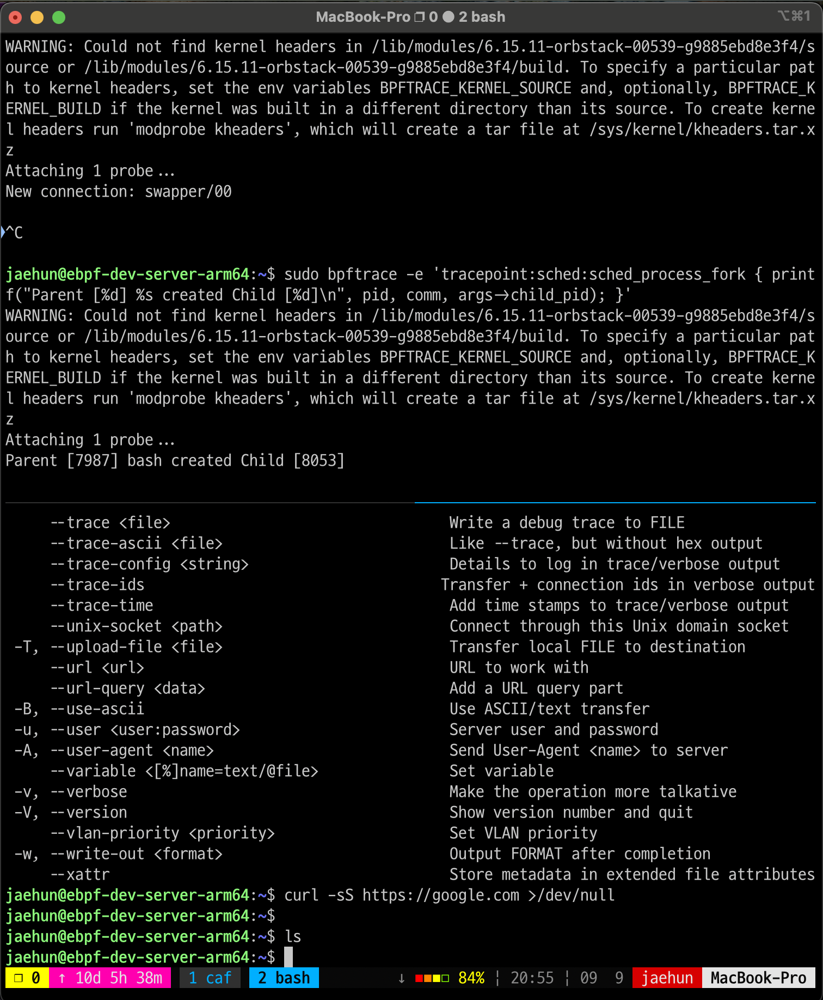

# Week 1 - 김재훈

## 환경 설정
- OS:
    - Host: macOS Sequoia 15.6.1
    - Docker: Ubuntu Oracular 24.10
        - Kernel: 6.15.11-orbstack-00539-g9885ebd8e3f4
            - `umame -r` 명령으로 확인
        - 설치 도구: bpftrace v0.21.2

## bpftrce 실습
### 1. Hello World
```bash
sudo bpftrace -e 'BEGIN { printf("eBPF 스터디 시작!\n"); } interval:s:1 { printf("Hello from kernel! %d\n", pid); }'
```


### 2. 파일 오픈 추적
```bash
# 추적 명령어
sudo bpftrace -e 'tracepoint:syscalls:sys_enter_openat { printf("%-6d %-16s %s\n", pid, comm, str(args->filename)); }'

# 테스트 명령어
ls
```


### 3. 네트워크 연결 모니터링
```bash
# 추적
sudo bpftrace -e 'tracepoint:sock:inet_sock_set_state { if (args->newstate == 1) { printf("New connection: %s%d\n", comm, pid); } }'

# 테스트
curl -sS https://google.com >/dev/null
```


### 4. 프로세스 생성 감지
```bash
# 추적
sudo bpftrace -e 'tracepoint:sched:sched_process_fork { printf("Parent [%d] %s created Child [%d]\n", pid, comm, args->child_pid); }'

# 테스트
ls
```


### 심화 학습
**2번 명령어부터 표시되는 warning 로그는 무엇일까?**
- 해당 경고는 bpftrace가 현재 커널에서 필요한 시스템 콜을 정확하게 호출하기 위해서 매핑되는 C 헤더파일 및 빌드 트리를 참조하는데 현재 이를 찾을 수 없다는 경고로 해석할 수 있음
    - **왜 발생했을까?(의심)** 커널명에 OrbStack이 들어간 것을 알 수 있듯이 OrbStack은 프로그램 아키텍처상 자체적인 커널로 VM을 띄우고 도커 런타임이 해당 VM 위에 설치되는 방식
    -> 우리가 쓰는 Ubuntu 배포판을 직접 설치했다면 해당 헤더/빌드 트리가 존재했겠지만 컨테이너 환경이라 없는 것으로 유추됨
        - 해당 유추는 잘못됨 기본적으로 헤더 패키지는 기본적으로 따로 설치하지 않으면 포함되지 않음
    - 추가 심화학습할만한 개념:
        - 사실 위의 설명은 오개념을 포함하고 있음. 정확한 의미로는 bpftrace가 eBPF 프로그램을 컴파일/해석할 때 커널 내부 타입을 해석할 수 있도록 실행중인 커널과 매칭되는 헤더/빌드 트리를 찾는 과정에서 발생하는 경고라고 하는데.
            - bpftrace가 어떤 목적으로 eBPF 프로그램을 컴파일/해석하고 이게 파일 실행 결과로 이어져서 경고 로그를 표시하는지 이해하지 못 함

**지금 꼭 해결해야 할까?**
- tracepoint를 사용하면 경고가 있어도 정상 동작함. -> 왜?
    - 커널이 미리 정의해둔 이벤트 지점으로 이벤트의 인자 목록과 레이아웃과 같은 메타데이터를 따라갈 수 있게 하기 때문에
        - 추가 심화학습할만한 개념: 커널 데이터 구조체, 필드 오프셋, 타입

**만약 해결하고 싶다면 어떻게 할 수 있을까**
- BTF(BPF Type Format)이나 kheaders로 해결 가능
    - BTF: tracepoint와 마찬가지로 커널의 메타데이터(구조체, 필드 오프셋, 함수 시그니처 등)를 경량화하여 파일로 제공함.
        - 파일 예시: `/sys/kernel/btf/vmlinux`
        - 추가 심화학습할만한 개념:
            - 왜 경량화했다고 할까?
            - tracepoint와 제공하는 게 비슷해보이는데, 무엇이 다를까?
    - kheaders: `modprobe kheaders` 명령어로 커널이 자체 헤더 아카이브를 제공하도록 할 수 있음.
        - 사전 배포된 헤더 패키지가 없을 때, 커넝리 빌드될 때 포함되어 있던 헤더 아카이브를 모듈로 노출시킴
            - 성공적으로 로드된 경우 `/sys/kernel/kheaders.tar.xz`가 생성됨
        - 단, 커널이 `CONFIG_IKHEADERS` 옵션을 켜고 빌드된 커널일 때만 해당 모듈이 존재
        - bpftrace와 연결하여 활용하는 방법
            ```bash
            sudo modprobe kheaders
            tmpdir=$(mktemp -d)
            sudo tar -C "$tmpdir" -xf /sys/kernel/kheaders.tar.xz
            export BPFTRACE_KERNEL_SOURCE="$tmpdir/usr/src/linux-headers-$(uname -r)"
            export BPFTRACE_KERNEL_BUILD="$BPFTRACE_KERNEL_SOURCE"
            ```
        - 추가 심화학습할만한 개념:
            - 위에서 언급된 옵션이 일반적인 배포판에서 켜져 있을까?
            - 해당 옵션을 가지고 헤더 파일들을 다시 만들었을 때, 정말로 경고가 해결될까?
            - 직접 설치, VM, 컨테이너 환경 각각에서 생성된 정보가 같을까? (내 이해대로라면 직접 설치와 VM은 같을 것 같고, 반가상화나 컨테이너 환경만 특수하게 다를 것으로 예상)