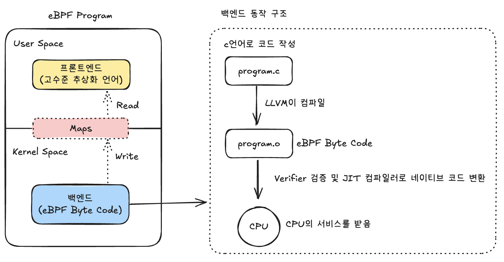

# Week2

## eBPF 프로그래밍이란 무엇인가요?


위 그림은 일반적인 eBPF 프로그래밍 방식 및 구조도입니다.

우선 eBPF는 커널의 데이터를 효과적으로 가져올 수 있는 프레임워크라고 볼 수 있는데요.
웹에 비유하자면 실제로 커널 정보를 가져오는 백엔드(커널 스페이스), 그리고 그 백엔드와 상호작용할 수 있는 프론트엔드(유저스페이스)로 나눌 수 있습니다.

백엔드는 리눅스 커널에 친화적인 C로 작성되며, 리눅스 커널의 핵심 영역(네트워크 스택/IO 스택)들의 정보를 가져올 수도 있으며, 또는 특정 동작을 수행할 수도 있습니다.
이러한 백엔드를 eBPF 프로그램이라고 할 수 있으며, C로 작성된 프로그램은 LLVM에 의해 eBPF 바이트코드로 변환됩니다.

이러한 eBPF 바이트 코드는 eBPF Verifier에 의해 무한 루프/메모리 접근 등의 검증을 받고, JIT(Just In Time) 컴파일러를 통해 CPU가 실행할 수 있는 네이티브 코드로 변환되어 수행됩니다.

기본적으로 리눅스 커널에 bpf() 시스템 콜이 내장되어 있어, 이러한 eBPF 프로그램을 커널에 로드할 수 있습니다.
**(커널 모듈 삽입하는 insmod와 다르게 검증기를 거쳐 샌드박스 환경에서 수행됨.)**

프론트엔드는 유저스페이스에서 실행되는 애플리케이션으로, 커널에 로드된 eBPF 프로그램과 상호작용하는 역할을 담당합니다.

프론트엔드 애플리케이션은 주로 C, Go, Python, Rust 등 다양한 언어로 작성할 수 있으며, libbpf 라이브러리나 각 언어별 바인딩을 통해 eBPF 프로그램을 제어합니다. 
이 애플리케이션은 먼저 컴파일된 eBPF 오브젝트 파일을 로드하고, bpf() 시스템 콜을 통해 커널에 프로그램을 적재한 후 적절한 훅 포인트에 연결하는 작업을 수행합니다.

## 커널의 데이터는 어떤 방식으로 유저스페이스로 가져오나요?

커널과 유저스페이스 간의 데이터 통신은 eBPF 맵을 통해 이루어집니다.
eBPF 프로그램이 커널에서 수집한 정보를 맵에 저장하면, 프론트엔드 애플리케이션이 이를 읽어와 분석하거나 시각화할 수 있습니다.
실시간 데이터 전송이 필요한 경우에는 Ring Buffer나 Perf Buffer 같은 특수한 맵 타입을 사용하여 이벤트 스트림을 처리할 수 있습니다

eBPF 프로그램에서 아래와 같이 Map 구조체를 선언할 수 있습니다.
아래 구조체는 key(uint 32), value(uint64)를 가진 배열형태의 가장 기초적인 Map입니다.

### Map 구조체 선언
```c
struct {
    __uint(type, BPF_MAP_TYPE_ARRAY);
    __type(key, __u32);
    __type(value, __u64);
    __uint(max_entries, 1);
} pkt_count SEC(".maps");
```
이외에도 다양한 Map 타입이 있으며 아래 github 코드를 통해 직접 보시는 것을 추천합니다.

### 다양한 Map 타입

아래는 [/linux/include/uapi/linux/bpf.h](https://github.com/torvalds/linux/blob/master/include/uapi/linux/bpf.h)에서 발췌한 Map 타입들입니다.
```c
enum bpf_map_type {
	BPF_MAP_TYPE_UNSPEC,
	BPF_MAP_TYPE_HASH,
	BPF_MAP_TYPE_ARRAY,
	BPF_MAP_TYPE_PROG_ARRAY,
	BPF_MAP_TYPE_PERF_EVENT_ARRAY,
	BPF_MAP_TYPE_PERCPU_HASH,
	BPF_MAP_TYPE_PERCPU_ARRAY,
	BPF_MAP_TYPE_STACK_TRACE,
	BPF_MAP_TYPE_CGROUP_ARRAY,
	BPF_MAP_TYPE_LRU_HASH,
	BPF_MAP_TYPE_LRU_PERCPU_HASH,
	BPF_MAP_TYPE_LPM_TRIE,
	BPF_MAP_TYPE_ARRAY_OF_MAPS,
	BPF_MAP_TYPE_HASH_OF_MAPS,
	BPF_MAP_TYPE_DEVMAP,
	BPF_MAP_TYPE_SOCKMAP,
	BPF_MAP_TYPE_CPUMAP,
	BPF_MAP_TYPE_XSKMAP,
	BPF_MAP_TYPE_SOCKHASH,
	BPF_MAP_TYPE_CGROUP_STORAGE,
	BPF_MAP_TYPE_REUSEPORT_SOCKARRAY,
	BPF_MAP_TYPE_PERCPU_CGROUP_STORAGE,
	BPF_MAP_TYPE_QUEUE,
	BPF_MAP_TYPE_STACK,
	BPF_MAP_TYPE_SK_STORAGE,
	BPF_MAP_TYPE_DEVMAP_HASH,
	BPF_MAP_TYPE_STRUCT_OPS,
	BPF_MAP_TYPE_RINGBUF,
	BPF_MAP_TYPE_INODE_STORAGE,
	BPF_MAP_TYPE_TASK_STORAGE,
};
```

## CO-RE는 무엇일까요?

CO-RE(Compile Once - Run Everywhere)는 eBPF 프로그램의 호환성 문제를 해결하는 기술입니다.

기존 eBPF 개발에서는 커널 버전마다 데이터 구조체의 레이아웃이 달라지는 문제가 있었습니다.
예를 들어 task_struct 구조체의 필드 순서나 크기가 커널 4.x와 5.x에서 다르게 변경되면, 각 커널 버전에 맞춰 eBPF 프로그램을 다시 컴파일해야 했습니다.

CO-RE는 이 문제를 BTF(BPF Type Format)와 libbpf의 재배치 기능으로 해결합니다.
BTF는 커널이 자신의 데이터 구조 정보를 표준화된 형태로 제공하는 메타데이터 포맷으로, /sys/kernel/btf/vmlinux 파일을 통해 접근할 수 있습니다. 
개발자는 vmlinux.h 헤더 파일과 BPF_CORE_READ 같은 매크로를 사용하여 커널 구조체에 접근하는 코드를 작성합니다.

컴파일 시점에 clang은 재배치 정보를 오브젝트 파일에 포함시키고, 런타임에 libbpf 로더가 현재 실행 중인 커널의 BTF 정보를 읽어 실제 메모리 오프셋을 계산합니다.
이를 통해 컴파일 타임의 구조체 레이아웃과 런타임의 실제 레이아웃 차이를 자동으로 보정하여, 한 번 컴파일된 eBPF 프로그램이 다양한 커널 버전에서 올바르게 동작할 수 있게 됩니다.

결과적으로 CO-RE는 eBPF 프로그램의 이식성을 크게 향상시켜 프로덕션 환경에서의 안정적인 배포를 가능하게 하며, 현재 eBPF 개발의 표준 방식으로 자리잡았습니다.
